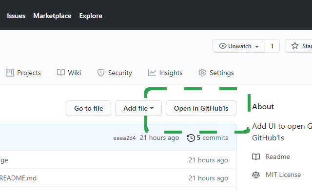
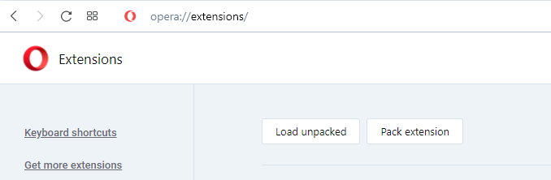
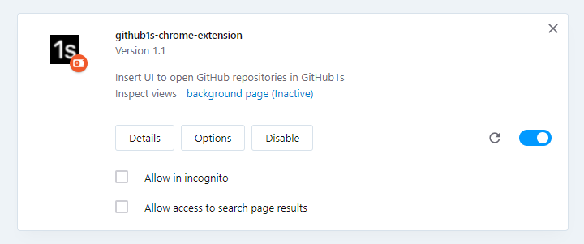
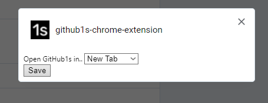

 Add a new navigation option to open GitHub repositories in GitHub1s.

| |
|:---:|
|  |
| Install the GitHub1s extension in the [Chrome web store](https://chrome.google.com/webstore/detail/github1s-chrome-extension/iijaagbkdohcopmmohlgfkcloefoeaoj). |

## About
| |
|:---:|
|  |
| This extension creates additional UI within GitHub repositories, making it easier to open them in GitHub1s. |

[GitHub1s](https://github1s.com/conwnet/github1s) is a web-app for viewing GitHub repository files online, using a web-compiled version of VSCode. This extension introduces a new UI button to the GitHub repository file navigation bar, enabling users to easily open the repository inside the GitHub1s website.

## Manual installation
| |
|:---:|
|  |
| Navigate to `chrome://extensions` and `load unpacked`. |

1. Clone this repository onto your device.
2. Navigate to `chrome://extensions/` (replace `chrome` with the name of your Chromium based browser, for instance `opera://extensions/`).
3. Open the file explorer using `Load unpacked` and navigate to the root folder of this repository. 
4. Select this folder, and the extension should load into your list of browser extensions.

## User options
| Extension card | Options page |
|:---:|:---:|
|  |  |

The extension can be configured from `chrome://extensions` using the `options` button on the extension card. Users can select between opening GitHub1s in the current tab (redirect) or opening the website in a new tab.

## License
MIT